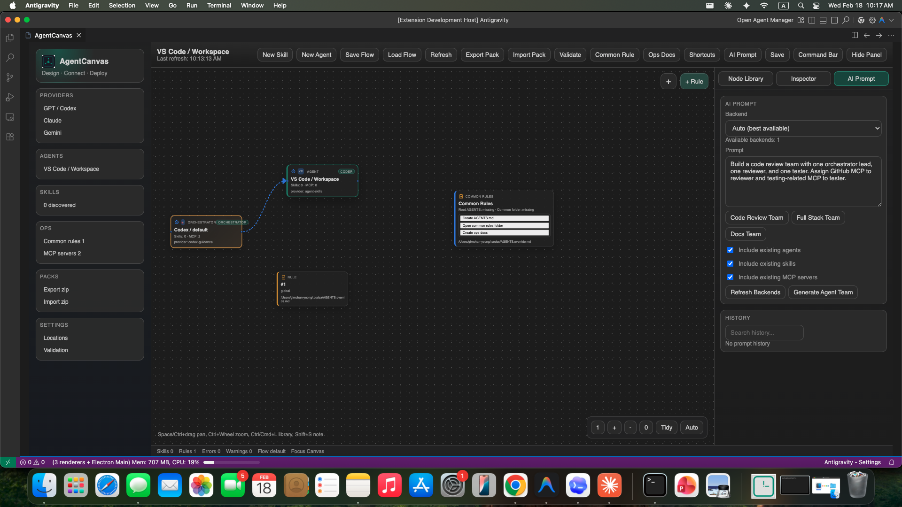

# Open Claw

Open Claw is a VS Code extension for designing and operating multi-agent systems on a visual canvas.
It combines agent modeling, chat-first orchestration workflow, prompt-driven team generation, and real-time task scheduling in one workspace.

## What This Project Includes

- Visual canvas UI for multi-agent orchestration (Graph / Kanban / Schedule views)
- Chat-first workflow
  - Orchestrator-driven conversation interface
  - Work plan generation and confirmation via chat
  - Real-time task status streaming inline
- Agent lifecycle management
  - Create/Delete custom agents
  - Role, description, system prompt, avatar, color editing
  - Orchestrator delegation links
- Skill and MCP assignment
  - Drag-and-drop from library to agent nodes
  - Assign/Unassign from agent detail modal
- AI-powered team build
  - Multi-backend support (Claude / Gemini / Codex)
  - Backend-aware agent assignment with usage budget balancing
  - Prompt-to-team generation with preview and apply
  - Codex cache fast-path for repeated builds
- Task execution engine
  - Parallel task scheduling with dependency resolution
  - Stall detection and graceful cancellation
  - Worker-to-Orchestrator question escalation (NEED_HUMAN flow)
- Flow and observability support
  - Save/Load flow files: `.agentcanvas/flows/*.yaml`
  - Interaction event logs: `.agentcanvas/logs/<flow>/<date>.jsonl`
- Quality gates
  - Build + typecheck pipeline
  - Integration test scenarios

## Architecture Overview

- `extension/`: VS Code extension backend (discovery, messaging, flow/log persistence, CLI execution)
- `webview-ui/`: React + React Flow frontend (canvas, node library, inspector, modal workflows)
- `resources/patterns/`: interaction pattern JSON templates
- `docs/interaction-patterns/patterns/`: interaction pattern documentation
- `scripts/integration-tests.cjs`: integration test runner

## Quick Start

```bash
npm install
npm --prefix webview-ui install
npm run check
```

Then in VS Code:

1. Open this project folder.
2. Press `F5` to launch Extension Development Host.
3. Open Command Palette and run `Open Claw: Open`.

## How to Use

### 1) Chat with Orchestrator

1. Open the **Chat** panel on the right.
2. Describe your work (e.g. "Build a login page with tests").
3. The Orchestrator generates a work plan with tasks.
4. Review the plan and click **Start Work Plan** to execute.

### 2) Build your agent graph

1. Click `New Agent` to create custom agents.
2. Double-click an agent node to open `Agent Detail`.
3. In `Overview`, set role, description, and orchestrator options.
4. In `Delegates To`, choose worker agents for orchestration links.

### 3) Generate teams from prompt

1. Enter a build prompt in the Build Prompt Bar.
2. Backends are auto-assigned per agent based on work intent.
3. Review the preview modal and click `Apply to Canvas`.

### 4) Monitor execution

1. Switch to **Kanban** view to see task status columns (Ready / Running / Done / Failed).
2. Switch to **Schedule** view for timeline-based Gantt visualization.
3. Double-click a task node for detailed logs and agent question responses.

### 5) Save and reload flows

1. Click `Save Flow` to persist current interaction graph.
2. Click `Load Flow` and enter/select a saved flow name.

## Integration Tests

```bash
npm run test:integration
```

Covers:

- Build/type integrity
- Pattern assets/schema consistency
- Prompt parser/history roundtrip
- Agent profile CRUD/assignment/delegation
- CLI backend detection shape
- Flow save/load/list roundtrip
- Interaction JSONL log append

## UI Screenshot



## Core Spec Docs

- `FRAMEWORK.md` — 전체 시스템 아키텍처
- `WORKFLOW.md` — 작업 실행 흐름 설계
- `CHAT_WORKFLOW_SPEC.md` — Chat-first 워크플로우 설계
- `AGENT_TEAM_BUILD_SPEC.md` — 팀 빌드 & 백엔드 할당 시스템
- `UI.md` — UI 컴포넌트 설계
- `UX.md` — UX 설계 원칙
- `EFFECT_ASSET_PROMPTS.md` — 에셋 프롬프트 가이드
